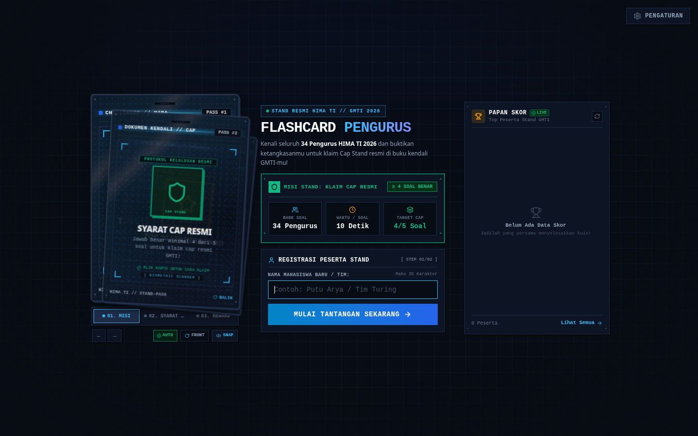
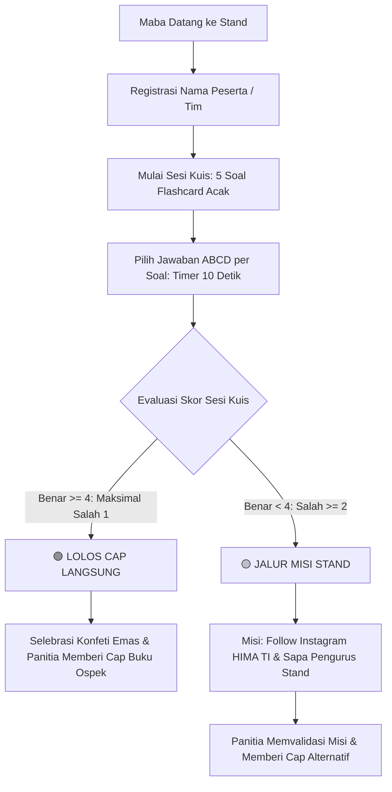
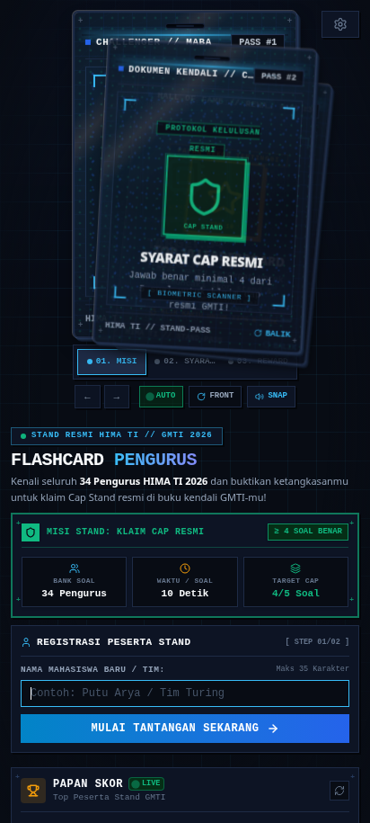

# ⚡ Minigames Flashcard HIMA TI // Stand GMTI 2026

[](https://minigames.jaydev.my.id)
[](https://react.dev)
[](https://vite.dev)
[](https://tailwindcss.com)
[](https://www.framer.com/motion/)
[](https://nodejs.org)
[](https://sqlite.org)
[](https://pages.github.com)

<p align="center">
  <a href="https://minigames.jaydev.my.id">
    
  </a>
</p>

Aplikasi kuis interaktif tebak nama dan divisi pengurus **Himpunan Mahasiswa Program Studi Teknik Informatika (HIMA TI)** yang dirancang khusus untuk **Stand Booth Ospek / Gelar Mahasiswa TI (GMTI) Mahasiswa Baru 2026**.

Website ini menggabungkan antarmuka bertema **Cyber-Arcade Tech**, animasi kartu 3D berkecepatan tinggi, audio synthesizer mandiri (tanpa file audio eksternal), serta sistem validasi cap otomatis untuk buku kendali orientasi mahasiswa baru.

---

## 🌐 Akses Langsung (Live Website)

Website sudah di-hosting aktif di GitHub Pages dengan custom domain:
👉 **[https://minigames.jaydev.my.id](https://minigames.jaydev.my.id)**

> 💡 **Bisa langsung dimainkan di perangkat mana saja tanpa perlu install Node.js atau menjalankan terminal!**

---

## 🎯 Konsep & Alur Permainan (Core Game Loop)

Tujuan utama mahasiswa baru (maba) mengunjungi stand HIMA TI adalah mengenal struktur kepengurusan organisasi sekaligus mendapatkan **Cap Stempel Stand HIMA TI** pada buku panduan ospek mereka.



### Aturan Perolehan Cap Stand:
1. **Lolos Cap Langsung (Skor $\ge$ 80% / Minimal 4 Benar dari 5 Soal):**
   - Mendapatkan selebrasi konfeti meriah, kartu reputasi emas, dan instruksi langsung untuk panitia agar memberikan **Cap Stand HIMA TI**.
2. **Jalur Misi Stand (Kesempatan Kedua):**
   - Peserta yang belum mencapai batas minimal benar diarahkan menyelesaikan misi interaktif:
     - 📱 **Misi 1:** Follow akun Instagram resmi HIMA TI (`@himati_official`).
     - 🤝 **Misi 2:** Sapa dan sebutkan nama serta divisi salah satu kakak pengurus yang sedang berjaga di meja stand.
   - Panitia memverifikasi dan tetap memberikan cap stand, sehingga semua maba terdorong berinteraksi secara ramah.

*(Catatan: Ambang batas minimal benar, timer, dan jumlah soal dapat diatur fleksibel melalui Dashboard Admin).*

---

## 🏗️ Arsitektur Dual-Mode (Online Cloud & Offline Stand)

Aplikasi dirancang dengan arsitektur **Hybrid Plug-and-Play**:

```
                               ┌──────────────────────────────────────────────┐
                               │       Frontend (React 19 + Vite)             │
                               │  - 3D Card Stack (Framer Motion)             │
                               │  - Web Audio Synthesizer (BGM + SFX)         │
                               │  - Client API Interceptor                    │
                               └──────────────────────┬───────────────────────┘
                                                      │
                         ┌────────────────────────────┴────────────────────────────┐
                         ▼                                                         ▼
         [ MODE 1: Static Cloud Hosting ]                          [ MODE 2: Local Stand Server ]
         - Platform: GitHub Pages                                  - Platform: Laptop Stand (Offline)
         - Domain: minigames.jaydev.my.id                          - Runtime: Node.js Express Server
         - Storage: LocalStorage Client                            - Database: SQLite (hima_games.sqlite)
         - Assets: 34 Foto Pengurus di CDN Pages                   - Jaringan: LAN / Wi-Fi Hotspot Lokal
         - Skenario: Dibuka langsung dari browser                  - Skenario: Hari-H booth stand tanpa internet
```

| Fitur | Mode 1: Static Cloud (GitHub Pages) | Mode 2: Local Stand Server (Offline) |
|---|---|---|
| **Akses** | Buka `https://minigames.jaydev.my.id` | Jalankan `npm start` di laptop stand |
| **Koneksi Internet** | Butuh internet saat memuat halaman pertama | **100% Offline (Tanpa Internet)** |
| **Database** | `localStorage` Browser | Database SQLite Lokal (`hima_games.sqlite`) |
| **Penyimpanan Skor** | Tersimpan di memori browser laptop stand | Tersimpan permanen di file harddisk |
| **Akses Multi-Device** | Mandiri per browser | Tersentralisasi via IP Hotspot Lokal |
| **Kesiapan Pakai** | **Langsung Pakai (Zero Setup)** | Butuh terminal & Node.js terpasang |

---

## 💎 Fitur-Fitur Unggulan

### 1. 3-Section Parallel Homepage & Mobile Responsive
Antarmuka visual modern dan adaptif, baik di layar monitor laptop stand maupun di layar smartphone peserta:

<p align="center">
  
  &nbsp;
  
</p>

* **Kolom Kiri (3D Interactive Card Stack Preview):**  
  Simulasi tumpukan kartu pengurus 3D dengan gestur drag/swipe, rotasi bolak-balik (front/back flip), efek fanning tumpukan, serta auto-switch kartu berkala.
* **Kolom Tengah (Registration & Cockpit Misi):**  
  Formulir input nama peserta dengan validasi nama unik (mencegah nama ganda pada hari yang sama), ringkasan aturan durasi kuis, serta ketentuan perolehan cap.
* **Kolom Kanan (Live Leaderboard Panel):**  
  Papan skor real-time yang melakukan auto-refresh berkala (setiap 15 detik) lengkap dengan peringkat, catatan waktu presisi (detik), dan status perolehan cap (`lolos` / `misi`).

### 2. Gameplay Flashcard Dinamis
* **Animasi 3D Realistis:** Didukung Framer Motion dengan efek tilt perspektif, bayangan kedalaman kartu, dan transisi mulus.
* **Dynamic Timer Bar:** Waktu menghitung mundur dengan visual bar menyusut. Pada 3 detik terakhir, warna bar berubah merah berdenyut (*warning pulse*) untuk memacu ketegangan.
* **Smart Auto-Distractor (Pilihan ABCD Cerdas):**  
  Sistem secara otomatis mengelompokkan gender dan divisi pengurus agar pilihan ganda pengecoh yang disajikan tampak kredibel dan menantang (tidak acak-acakan).
* **Mode Spill Jawaban:**  
  Dapat dikonfigurasi antara **Mode Akhir** (kunci jawaban baru diperlihatkan di akhir sesi untuk menjaga unsur kejutan) atau **Mode Langsung** (review jawaban benar/salah secara langsung per soal).

### 3. Audio Engine Lengkap (100% Web Audio API)
Tidak memerlukan file `.mp3` atau aset audio eksternal yang rawan gagal dimuat:
* **BGM Synthesizer:** 4 genre musik latar yang dihasilkan secara prosedural lewat osilator audio:
  1. *Arcade 8-Bit Chiptune* (Ceria & retro)
  2. *Cyberpunk Synthwave* (Modern & ritmis)
  3. *Ambient Lofi Chill* (Tenang & fokus)
  4. *Stadium EDM Hype* (Enerjik & kompetitif)
* **5 Profil Tactile SFX:**
  * *Cyber Laser*, *Mechanical Tactile*, *Arcade Pop*, *Digital Chime*, dan *Acoustic Shuffle*.
* **Dual Audio Mixer Modal:** Kontrol volume master BGM dan efek suara secara independen dengan slider presisi.

### 4. Command Center Admin (Terproteksi PIN)
Panel khusus panitia stand untuk mengatur seluruh sistem secara instan:
* **PIN Akses:** Default `2026`.
* **Pengaturan Permainan:** Ubah jumlah soal per sesi (3–15 soal), timer durasi (5–30 detik), syarat minimal benar cap, gaya animasi kartu, dan teks misi tambahan.
* **Manajemen Pengurus (CRUD):** Tambah pengurus baru, upload foto lokal, ubah nama/divisi, dan toggle status aktif pengurus.
* **Card Studio Simulator:** Uji coba kartu pengurus langsung di dalam dashboard.
* **Manajemen Leaderboard:** Reset riwayat skor sekali klik per sesi/hari ospek.
* **Backup & Restore:** Ekspor seluruh data pengurus dan pengaturan ke file `.json` serta impor kembali kapan saja.

---

## 📋 Daftar 34 Pengurus Resmi HIMA TI (Pre-Seeded)

Database bawaan telah memuat lengkap 34 pengurus HIMA TI beserta foto resmi:

| No | Nama Pengurus | Divisi / Jabatan |
|:---:|---|---|
| 1 | Ni Nyoman Putri Kirana | Ketua Umum (BPH) |
| 2 | I Made Bintang Kartika Yasa | Wakil Ketua 1 (BPH) |
| 3 | I Gede Angga Yudistira | Wakil Ketua 2 (BPH) |
| 4 | Putu Kencana Sridewi | Sekretaris 1 (BPH) |
| 5 | Dewa Ayu Dwicahya Dewanti | Sekretaris 2 (BPH) |
| 6 | Ida Ayu Ika Pramesti Kesuma | Bendahara 1 (BPH) |
| 7 | Ida Ayu Gede Sri Widiani | Bendahara 2 (BPH) |
| 8 | Kadek Yuni Dwiyantini Savitri | Kabid Minat dan Bakat |
| 9 | I Putu Adhiatman | Kabid Media dan Humas |
| 10 | Kadek Novan Suhaliem Chandra | Kabid Penelitian & Pengabdian Masyarakat |
| 11 | I Komang Bayu Kurniawan | Kadiv Media |
| 12 | I Gst.N.Pt.Diana Putra Pratama | Kadiv Humas |
| 13 | Fiji Firmanda | Kadiv Penelitian |
| 14 | Putu Raditya Dharma Putra | Kadiv Pengabdian Masyarakat |
| 15–18 | Anggota Minat & Bakat | Ida Bagus Gede Dharmayoga, I Wayan Oka Eswara, Ni Putu Dewi Candra Wangi, I Made Arya Krisna |
| 19–22 | Anggota Divisi Media | I Made Agastya, I Gusti Bagus Agung Andra, I Made Adhi Pranaya, I Kadek Abi Prawira |
| 23–26 | Anggota Divisi Humas | Ida Bagus Windu, I Dewa Gede Ariesta, I Made Chandra Yudi, Ni Kadek Ayu Dea Santika |
| 27–30 | Anggota Divisi Penelitian | I Made Kusuma Jaya, Gede Satya Devra, Putu Gde Adyatma, Ngurah Gde Rheino Darma |
| 31–34 | Anggota Divisi Pengmas | Luh Gede Manik Prascita, Ni Wayan Ananda, Ni Made Adinda, Ton Klein Pandesolan |

---

## 🚀 Panduan Instalasi & Menjalankan Lokal

Jika Anda ingin menjalankan aplikasi secara lokal di laptop stand atau melakukan modifikasi kode:

### Persyaratan Sistem
* **Node.js**: Versi `v20.0.0` ke atas (Direkomendasikan Node `v22+` untuk dukungan modul bawaan `node:sqlite`).
* **npm**: Versi `v8.0.0` ke atas.
* **Browser**: Chrome, Brave, Edge, atau Firefox versi modern.

---

### Langkah 1: Clone Repository
```bash
git clone https://github.com/kusjay-space/hima-ti-minigames-ultimate.git
cd hima-ti-minigames-ultimate
```

---

### Langkah 2: Install Dependensi
Repository ini dikonfigurasi menggunakan **npm workspaces**. Cukup jalankan satu perintah di folder root:

```bash
npm install
```
*Perintah ini otomatis menginstal dependensi root, backend (Express, CORS, Multer, better-sqlite3), dan frontend (React, Vite, Tailwind, Framer Motion, Lucide) dalam 1 kali proses.*

---

### Langkah 3: Menjalankan Aplikasi

#### 🟢 Opsi A: Mode Siap Pakai Stand Booth (Rekomendasi Hari-H)
Mode ini mengompilasi frontend ke file produksi berkecepatan tinggi dan melayani antarmuka serta API SQLite melalui 1 port server:

```bash
npm start
```
Buka browser di laptop stand:  
👉 **`http://localhost:3000`**

---

#### 🟡 Opsi B: Mode Pengembangan (Live Reload)
Gunakan mode ini jika Anda ingin mengedit kode, komponen, atau styling secara langsung:

```bash
npm run dev
```
Perintah ini menyalakan secara paralel:
* **Backend Express Server:** `http://localhost:3000`
* **Vite Dev Server:** `http://localhost:5173` *(dengan proxy otomatis ke port 3000 untuk `/api` dan `/uploads`)*

Buka browser di:  
👉 **`http://localhost:5173`**

---

### Langkah 4: Akses Smartphone Maba (Jaringan Hotspot Stand)

Jika antrean di depan laptop stand padat, maba atau panitia dapat memainkan game ini langsung dari layar HP masing-masing melalui Wi-Fi lokal:

1. Sambungkan laptop stand dan smartphone maba ke **Hotspot / Wi-Fi yang sama**.
2. Cari tahu IP lokal laptop stand (contoh di terminal: `ip a` di Linux atau `ipconfig` di Windows, misal: `192.168.1.15`).
3. Buka browser smartphone maba dan ketik:
   ```text
   http://192.168.1.15:3000
   ```
4. Kuis dapat langsung dimainkan dari layar smartphone, dan nilai skornya otomatis masuk ke leaderboard di layar laptop stand.

---

## ⚙️ Ringkasan Script `package.json`

| Perintah | Deskripsi |
|---|---|
| `npm install` | Menginstal seluruh dependensi root, backend, dan frontend sekaligus via npm workspaces. |
| `npm start` | Melakukan build frontend lalu menjalankan server backend produksi di port 3000. |
| `npm run dev` | Menjalankan backend server dan Vite dev server secara bersamaan (`concurrently`). |
| `npm run build` | Mengompilasi TypeScript dan bundler Vite pada folder `frontend/` ke folder `dist/`. |
| `npm run lint` | Melakukan audit linting kode frontend menggunakan `oxlint`. |

---

## 📁 Struktur Direktori Proyek

```text
minigames-hima-ti/
├── .github/
│   └── workflows/
│       └── deploy.yml            # Otomasi build & deploy ke GitHub Pages
├── backend/
│   ├── db.js                     # Inisialisasi SQLite (node:sqlite / better-sqlite3)
│   ├── server.js                 # Server Express, REST API, upload multer, proxy
│   ├── seedData.js               # Data awal 34 pengurus resmi & auto-seed
│   ├── importCsvPengurus.js      # Utility parser CSV kepengurusan
│   ├── hima_games.sqlite         # File database SQLite lokal (dibuat otomatis)
│   ├── package.json              # Konfigurasi dependensi backend
│   └── uploads/                  # Penyimpanan foto pengurus lokal
├── frontend/
│   ├── public/
│   │   ├── CNAME                 # Konfigurasi domain minigames.jaydev.my.id
│   │   ├── favicon.svg           # Ikon browser
│   │   └── uploads/              # Aset statis foto pengurus untuk GitHub Pages
│   ├── src/
│   │   ├── components/
│   │   │   ├── admin/
│   │   │   │   └── AdminDashboard.tsx   # Command Center Admin terproteksi PIN
│   │   │   └── game/
│   │   │       ├── WelcomeScreen.tsx    # 3-Section layout: 3D Stack, Registrasi, Leaderboard
│   │   │       ├── FlashcardGame.tsx    # Gameplay kuis, timer 10s, kartu interaktif
│   │   │       ├── FlashcardCard.tsx    # Komponen visual kartu 3D flip Framer Motion
│   │   │       ├── OptionButton.tsx     # Tombol opsi ABCD dengan tactile feedback
│   │   │       ├── ResultScreen.tsx     # Layar perolehan Cap Stand & konfeti
│   │   │       ├── AudioMixerModal.tsx  # Kontrol independen volume BGM & SFX
│   │   │       └── LeaderboardModal.tsx # Modal detail klasemen skor
│   │   ├── lib/
│   │   │   ├── apiFallback.ts   # Engine mock client-side untuk GitHub Pages
│   │   │   └── soundEffects.ts  # Web Audio API Synthesizer (BGM & SFX)
│   │   ├── types.ts             # Definisi TypeScript interface & type
│   │   ├── App.tsx              # Routing status layar (welcome, playing, result)
│   │   ├── index.css            # Styling kustom Tailwind CSS v4
│   │   └── main.tsx             # Entry point React 19
│   ├── package.json             # Konfigurasi dependensi frontend
│   └── vite.config.ts           # Konfigurasi build Vite & proxy backend
├── .env.example                 # Contoh template konfigurasi port
├── .gitignore                   # Daftar file yang dikecualikan dari Git
├── package.json                 # Konfigurasi root workspaces & npm scripts
└── README.md                    # Dokumentasi lengkap proyek
```

---

## 📡 Dokumentasi REST API Backend

Backend Express menyediakan endpoint JSON untuk operasional kuis dan dashboard admin:

| Endpoint | Method | Deskripsi |
|---|:---:|---|
| `/api/settings` | `GET` | Mengambil seluruh konfigurasi kuis aktif (timer, soal, style, PIN). |
| `/api/settings` | `POST` | Memperbarui konfigurasi kuis (membutuhkan validasi `adminPin`). |
| `/api/quiz-session` | `GET` | Membuat sesi kuis baru dengan 5 soal acak dan pilihan ABCD cerdas. |
| `/api/check-name` | `GET` | Memeriksa apakah nama peserta sudah terdaftar di leaderboard. |
| `/api/pengurus` | `GET` | Mengambil daftar pengurus aktif (gunakan query `?all=true` untuk admin). |
| `/api/pengurus` | `POST` | Menambah pengurus baru (mendukung upload foto via `multipart/form-data`). |
| `/api/pengurus/:id` | `PUT` | Memperbarui nama, divisi, foto, atau status aktif pengurus. |
| `/api/pengurus/:id` | `DELETE` | Menghapus data pengurus dari database. |
| `/api/leaderboard` | `GET` | Mengambil daftar peringkat peserta teratas berdasarkan skor dan waktu. |
| `/api/leaderboard` | `POST` | Menyimpan hasil permainan peserta ke database leaderboard. |
| `/api/leaderboard/reset` | `POST` | Mengosongkan leaderboard sesi (membutuhkan validasi `adminPin`). |
| `/api/backup/import` | `POST` | Melakukan restore data dari file JSON cadangan. |

---

## 🛠️ Pemecahan Masalah (Troubleshooting & FAQ)

### 1. Port 3000 Sudah Terpakai (`EADDRINUSE`)
Jika port default 3000 sedang dipakai oleh aplikasi lain di komputer Anda, server tidak akan crash sembarangan. Anda cukup menentukan port lain:
* **Linux / macOS:**  
  ```bash
  PORT=3005 npm start
  ```
* **Windows (Command Prompt):**  
  ```cmd
  set PORT=3005 && npm start
  ```
* **Windows (PowerShell):**  
  ```powershell
  $env:PORT=3005; npm start
  ```
* Atau buat file `.env` dari `.env.example` dan tentukan `PORT=3005`. Proxy frontend otomatis menyesuaikan ke port tersebut.

### 2. Error Modul `node:sqlite` Tidak Ditemukan
* Modul bawaan `node:sqlite` membutuhkan minimal **Node.js v22.5.0**.
* Jika Anda memakai **Node.js v20**, sistem secara cerdas akan otomatis beralih menggunakan driver `better-sqlite3` tanpa error.
* Pastikan versi Node.js Anda minimal versi `v20.0.0` dengan memeriksa perintah `node -v`.

### 3. Domain `minigames.jaydev.my.id` Menampilkan `DNS check unsuccessful`
* Buka DNS manager domain Anda (misal Cloudflare).
* Pastikan record bertipe **CNAME** dengan nama `minigames` mengarah ke `kusjay-space.github.io`.
* Setel ke mode **DNS Only (Ikon awan abu-abu)** saat verifikasi awal agar GitHub dapat menerbitkan sertifikat SSL.
* Di halaman GitHub Pages Settings, klik tombol **Check again** atau masukkan ulang domain lalu klik **Save**.
* Tombol **Enforce HTTPS** akan dapat dicentang setelah sertifikat SSL selesai dibuat (memakan waktu $\pm$ 5–15 menit).

---

## 👥 Tim Pengembang & Hak Cipta

* **Penyelenggara:** Himpunan Mahasiswa Program Studi Teknik Informatika (HIMA TI)
* **Kategori Acara:** Gelar Mahasiswa TI (GMTI) / Ospek Mahasiswa Baru 2026
* **Lisensi:** ISC License

---

<p align="center">
  Dibuat dengan ❤️ dan dedikasi oleh <b>HIMA TI</b> untuk menyambut Mahasiswa Baru 2026.
</p>
