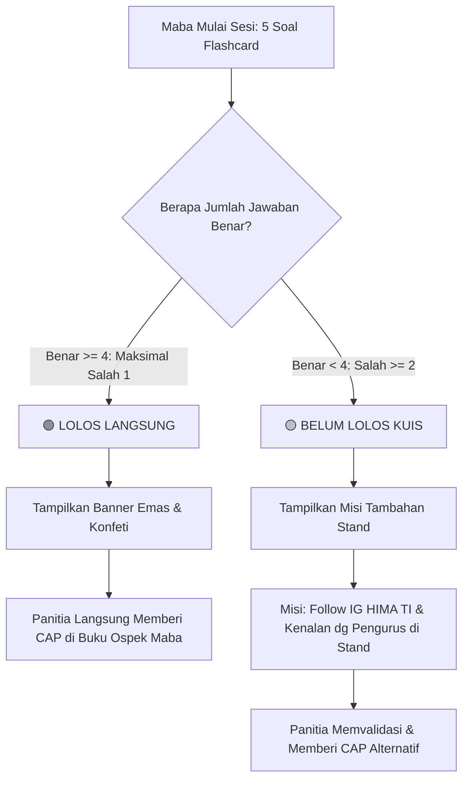

# 📋 SPESIFIKASI & ATURAN SISTEM MINIGAMES FLASHCARD HIMA PRODI TI
**Acara:** Stand Booth HIMA TI - Masa Orientasi Mahasiswa Baru (Ospek Maba)  
**Target Rilis:** 16 September 2026  
**Status Dokumen:** Approved & Final Specification v1.2 (SQLite + Framer Motion + Sistem Cap Ospek)

---

## 1. 🎯 Ringkasan & Konsep Permainan
Aplikasi minigame flashcard lokal interaktif untuk stand Himpunan Mahasiswa Program Studi Teknik Informatika (HIMA TI) pada masa Ospek Maba 2026.
- **Media:** 1 Laptop/Tablet di meja stand, maba bermain bergantian (individu atau tim).
- **Core Loop:**
  1. Maba memasukkan **Nama Peserta / Nama Tim**.
  2. Maba disajikan **5 soal flashcard acak** berisi foto pengurus HIMA TI.
  3. Setiap soal memiliki **timer 10 detik** dan pilihan ganda **A, B, C, D**.
  4. Layar akhir menentukan apakah maba berhak mendapatkan **CAP STAND HIMA TI** untuk buku kendali ospek mereka.

---

## 2. ⚡ Arsitektur & Tech Stack: Cepat, Ringan & Kokoh

### 🏆 Tech Stack Terpilih
| Layer | Teknologi | Alasan & Keunggulan |
| :--- | :--- | :--- |
| **Database** | **SQLite (`hima_games.sqlite`)** | **1 File Lokal, Anti-Hilang!** Data pengurus, pengaturan, dan riwayat skor tersimpan permanen di harddisk laptop stand. Tidak akan terhapus meski browser dibersihkan. |
| **Backend API** | **Node.js (Express) + Native SQLite** | Sangat ringan, startup dalam hitungan milidetik, menyediakan REST API untuk kelola pengurus, upload foto ke folder lokal `/uploads`, pengaturan sesi, dan leaderboard. |
| **Frontend UI** | **React (Vite) + Tailwind CSS** | Startup instan, hot-reload kencang, tampilan modern bertema *Cyber Tech TI* dengan kontras tinggi dan tombol lebar yang nyaman diklik. |
| **Animation Engine** | **Framer Motion (`framer-motion`)** | **Animasi Flashcard Terbaik:** Efek 3D Flip Card realistis saat kartu muncul/berpindah, transisi `AnimatePresence`, getaran shake merah pada jawaban salah, dan pulse hijau pada jawaban benar. |
| **Celebration Effect**| **Canvas Confetti** | Ledakan partikel konfeti saat maba berhasil lolos mendapatkan Cap Stand HIMA TI. |
| **Icons & SFX** | **Lucide Icons + Web Audio Synth** | Ikon modern tajam dan efek audio synthesizer bawaan browser (tanpa perlu download file mp3 eksternal). |

---

## 3. 🎖️ Sistem Penentuan Pemenang & Mekanisme Cap Stand

Tujuan utama maba mengunjungi stand adalah mengumpulkan **Cap Stempel Stand HIMA TI** pada buku/kartu ospek mereka.



### Rincian Aturan Kelulusan Cap:
1. **Lolos Langsung (Kemenangan Utama):**
   - **Syarat:** Maksimal salah 1 dari 5 soal (**Minimal 4 Benar** / Skor $\ge 80$).
   - **Tampilan:**
     - Banner Besar: 🎖️ **"SELAMAT! KAMU BERHAK MENDAPATKAN CAP STAND HIMA TI!"**
     - Efek ledakan konfeti perayaan.
     - Instruksi: *"Tunjukkan layar ini ke kakak pengurus di stand untuk langsung dicap bukunya!"*
2. **Belum Lolos Kuis (Kesempatan Kedua / Misi Alternatif):**
   - **Kondisi:** Salah 2 soal atau lebih (Skor $\le 60$).
   - **Tampilan:**
     - Banner: ⚡ **"BELUM DAPAT CAP OTOMATIS! EITS, JANGAN KHAWATIR!"**
      - Maba diarahkan menjalankan **Misi Stand**:
        - 📱 **Misi Stand:** Follow Instagram `@himaprodi_ti` & Spinwheel.
      - Setelah panitia memverifikasi, maba tetap mendapatkan **Cap Stand HIMA TI**.

*(Catatan: Ambang batas minimal benar ini dapat diatur oleh admin melalui Dashboard Admin, default: 4 dari 5).*

---

## 4. 🎮 Gameplay & Animasi Flashcard (Framer Motion)

### A. Fitur Animasi Interaktif
- **3D Card Flip & Perspective:** Kartu foto pengurus memiliki efek kedalaman 3D dengan transisi halus saat soal berganti.
- **Staggered Option Reveal:** Tombol pilihan A, B, C, D muncul bertahap (*cascading*) dari bawah.
- **Feedback Sentuhan:**
  - Jawaban Benar: Tombol menyala **Hijau Zamrud** dengan efek denyut lembut (*pulse*).
  - Jawaban Salah: Tombol berubah **Merah Neon** dengan efek getar (*shake animation*), dan sistem menunjukkan mana jawaban yang sebenarnya benar.
- **Timer Bar 10 Detik:**
  - Bar waktu menyusut mulus dari 10s ke 0s.
  - Sisa 3 detik: Bar berubah menjadi merah berdenyut (*warning pulse*) untuk memicu ketegangan yang seru.

### B. Mode Kuis Fleksibel (Diatur Admin)
- **Mode 1 - Tebak Nama Pengurus:** Tampilkan foto $\rightarrow$ Pilihan nama-nama pengurus.
- **Mode 2 - Tebak Divisi/Jabatan:** Tampilkan foto $\rightarrow$ Pilihan divisi pengurus (BPH, Medinfo, PSDM, Litbang, Humas, dll.).
- **Mode 3 - Mode Campuran (Mix):** Sistem mengacak jenis pertanyaan di setiap nomor.

### C. Smart Auto-Distractor
- Admin **hanya perlu memasukkan nama asli dan divisi pengurus**.
- Sistem otomatis mengambil 3 nama/divisi pengurus lain dari SQLite sebagai pilihan pengecoh (distractor) A, B, C, D. Admin tidak perlu membuang waktu mengarang opsi salah secara manual!

---

## 5. ⚙️ Fitur Dashboard Admin Stand

1. **Akses PIN:** Tombol gembok di pojok kanan atas, dilindungi PIN (Default: `2026`).
2. **Pengaturan Game (Session Config):**
   - Jumlah soal per sesi (Slider 3 - 15 soal, default: 5).
   - Durasi timer (Default: 10 detik).
   - Syarat Minimal Benar untuk Lolos Cap (Default: 4 dari 5 soal).
   - Mode kuis (Tebak Nama / Tebak Divisi / Campuran).
   - Custom teks untuk Misi Tambahan (Follow IG, dll.).
3. **Kelola Pengurus (CRUD SQLite):**
   - Tambah/Edit pengurus: Upload Foto (disimpan ke `/uploads`), Nama Lengkap, Divisi/Jabatan.
   - Toggle status aktif/nonaktif kartu.
   - Hapus kartu pengurus.
4. **Leaderboard & Riwayat:**
   - Tabel maba yang telah bermain (Nama/Tim, Skor Benar/Salah, Waktu, Status Lolos Cap).
   - Tombol "Reset Leaderboard" (misal per hari ospek).
5. **Cadangan Data (Backup):**
   - Export Data (JSON) & Import Data (JSON).

---

## 6. 📁 Struktur Folder Proyek

```text
minigames-hima-ti/
├── backend/
│   ├── db.js                # Inisialisasi SQLite & skema tabel
│   ├── server.js            # Express REST API (CRUD, settings, upload, leaderboard)
│   ├── uploads/             # Folder penyimpanan foto pengurus
│   └── seedData.js          # Data dummy starter pengurus HIMA TI
├── frontend/
│   ├── src/
│   │   ├── components/
│   │   │   ├── game/
│   │   │   │   ├── WelcomeScreen.tsx    # Input nama/tim maba
│   │   │   │   ├── FlashcardGame.tsx    # 3D Flip card, framer-motion, timer 10s
│   │   │   │   ├── OptionButton.tsx     # Tombol A B C D dengan feedback warna & shake
│   │   │   │   └── ResultScreen.tsx     # Status Lolos Cap / Misi Tambahan & Confetti
│   │   │   ├── admin/
│   │   │   │   ├── AdminDashboard.tsx   # Pengaturan sesi, ambang batas cap, & mode kuis
│   │   │   │   ├── PengurusManager.tsx  # Upload foto & input nama/divisi
│   │   │   │   └── LeaderboardAdmin.tsx # Rekap maba & reset data
│   │   │   └── ui/
│   │   ├── hooks/
│   │   │   └── useGame.ts
│   │   ├── App.tsx
│   │   └── main.tsx
│   ├── package.json
│   └── vite.config.ts
├── database.sqlite          # File database lokal SQLite
└── package.json             # Root script (npm run dev menjalankan backend + frontend)
```

---

## 7. 📜 Ringkasan Aturan Main Stand (Rules Sheet untuk Panitia)

| Parameter | Aturan |
| :--- | :--- |
| **Peserta** | 1 Mahasiswa Baru atau Tim Maba (2-3 orang). |
| **Durasi Game** | $\pm 1$ Menit (5 Soal $\times$ 10 Detik). |
| **Kriteria Cap Utama** | **Benar $\ge 4$ Soal (Maksimal Salah 1)** $\rightarrow$ Langsung diberi Cap Stand HIMA TI. |
| **Kriteria Cap Misi** | **Salah $\ge 2$ Soal** $\rightarrow$ Wajib Follow IG HIMA TI & sapa pengurus di stand sebelum diberi Cap. |
| **Peralatan Stand** | 1 Laptop stand (layar menghadap maba), mouse/touchpad/touchscreen, buku stempel cap stand. |
